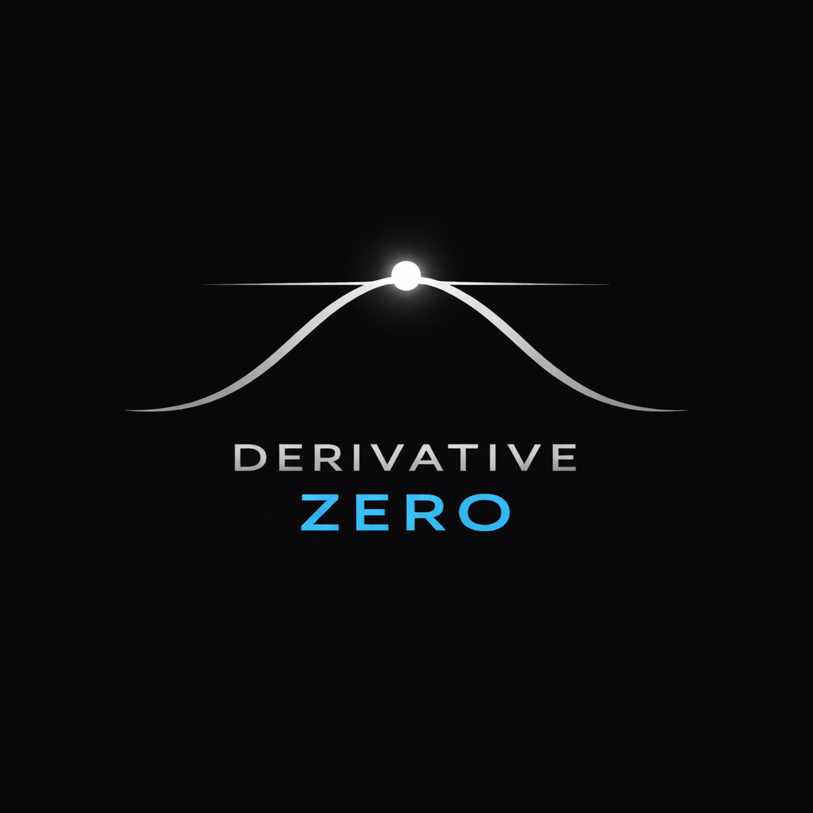

# Derivative-Zero



**Derivative Zero** - сервис, позволяющий комфортно работать 
с текстовой обучающей информацией: от школьных учебников до научных статей

## Desktop приложение

| ОС          | Приложение                                                                                                                          |
|-------------|-------------------------------------------------------------------------------------------------------------------------------------|
| **Windows** | [DerivativeZero-windows.exe](https://github.com/sodeeplearning/Derivative-Zero/releases/download/latest/DerivativeZero-windows.exe) |
| **Linux**   | [DerivativeZero-linux](https://github.com/sodeeplearning/Derivative-Zero/releases/download/latest/DerivativeZero-linux)             |
| **MacOS**   | [DerivativeZero-macOS](https://github.com/sodeeplearning/Derivative-Zero/releases/download/latest/DerivativeZero-macOS)             |

После установки приложения не забудьте перейти в ```Настройки агента```
и добавить ваш ключ к **OpenAI API**. Также есть поддержка любого API, имеющего
совместимость с OpenAI SDK, но тогда необходимо передать URL Вашего API.

## Для разработчиков

Если есть желание добавить что-то своё в **Derivative-Zero** - дерзайте! 

1. Создайте fork от main ветки
2. Внесите ваши изменения 
3. Создайте Pull Request к dev ветке

## Контакты

- Telegram @Notfag
- Email vitaliy.petreev@gmail.com