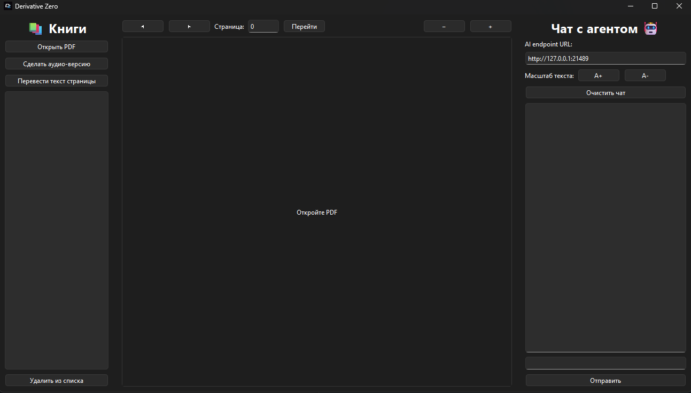
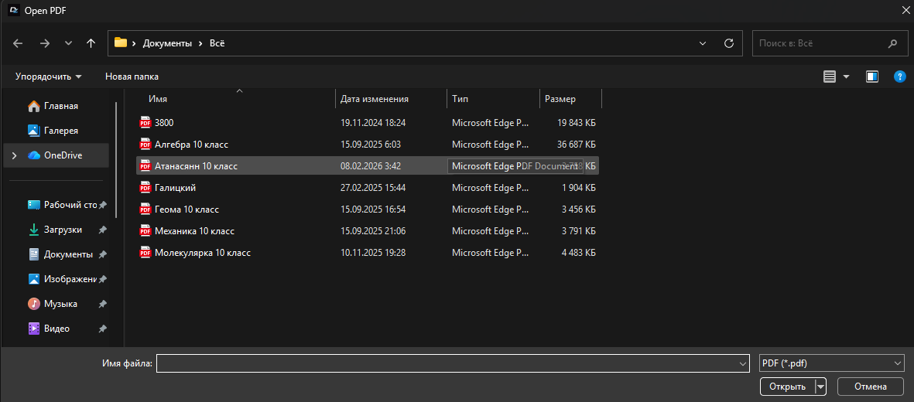
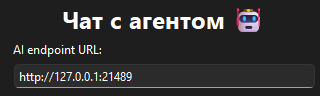
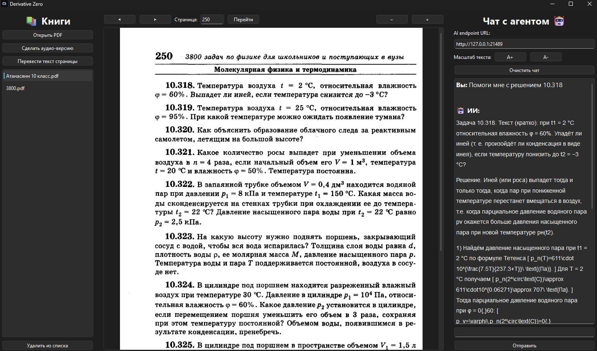

# Derivative-Zero


**Derivative Zero** - сервис, позволяющий комфортно работать 
с текстовой обучающей информацией: от школьных учебников до научных статей

**Содержание:**
- [Локальный запуск сервиса](#локальный-запуск-сервиса)
- [Как работать с приложением](#как-работать-с-приложением)
- [Для разработчиков](./docs/dev/README.md)

# Локальный запуск сервиса
Для того чтобы запустить backend часть сервиса, 
нужен установленный [Docker](https://www.docker.com/).
Затем скачайте репозиторий:
```bash
git clone https://github.com/sodeeplearning/Derivative-Zero.git
cd Derivative-Zero
```
Далее создайте ```.env``` файл по образцу из ```.env.dist```,
в котором укажите **OPENROUTER_API_KEY** - ключ к API, поддерживающему
OpenAI SDK формат. 

Рекомендуется использовать [Proxy API](https://proxyapi.ru/).
Если же вы используете что-то кроме Proxy API, следует указать поле
**OPENROUTER_HANDLER**, в котором укажите ссылку на ваш API.

# Как работать с приложением



Чтобы начать пользоваться приложением, нажмите ```Открыть PDF```
(пока реализована поддержка только PDF файлов)

После этого укажите путь до документа, с которым собираетесь работать


Убедитесь, что у вас корректно введён ```AI endpoint URL```,
иначе будет ошибка подключения к серверу



**Поздравляем! Вы настроили Derivative-Zero для вашей продуктивной работы**

Пример работы:

